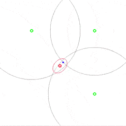

 ## A UKF demo program using pykalman

A simple UKF demo program which estimates a target's position from observations from range sensors. It utilizes pykalman to perform the non-linear state estimation.

